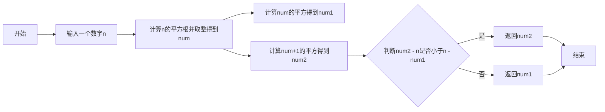
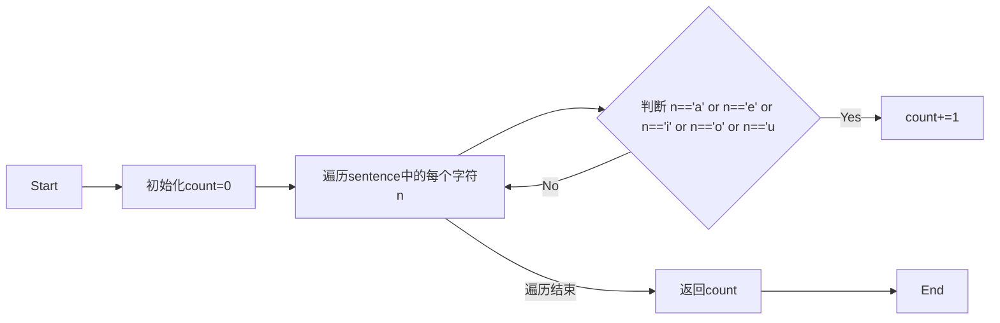
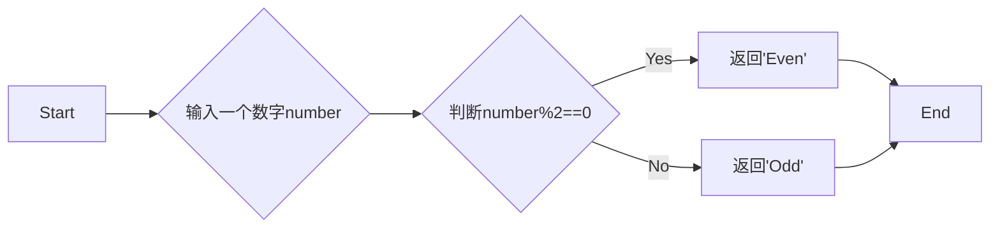

# 实验二 Python变量、简单数据类型

班级： 21计科1班

学号： 20190202222

姓名： 陈乐

Github地址：<https://github.com/lechen20/python_course>

CodeWars地址：<https://www.codewars.com/users/lechen20>

---

## 实验目的

1. 使用VSCode编写和运行Python程序
2. 学习Python变量和简单数据类型

## 实验环境

1. Git
2. Python 3.10
3. VSCode
4. VSCode插件

## 实验内容和步骤

### 第一部分

实验环境的安装

1. 安装Python，从Python官网下载Python 3.10安装包，下载后直接点击可以安装：[Python官网地址](https://www.python.org/downloads/)
2. 为了在VSCode集成环境下编写和运行Python程序，安装下列VScode插件
   - Python
   - Python Environment Manager
   - Python Indent
   - Python Extended
   - Python Docstring Generator
   - Jupyter
   - indent-rainbow
   - Jinja

---

### 第二部分

Python变量、简单数据类型和列表简介

完成教材《Python编程从入门到实践》下列章节的练习：

- 第2章 变量和简单数据类型

---

### 第三部分

在[Codewars网站](https://www.codewars.com)注册账号，完成下列Kata挑战：

---

#### 第1题：求离整数n最近的平方数（Find Nearest square number）

难度：8kyu

你的任务是找到一个正整数n的最近的平方数
例如，如果n=111，那么nearest_sq(n)（nearestSq(n)）等于121，因为111比100（10的平方）更接近121（11的平方）。
如果n已经是完全平方（例如n=144，n=81，等等），你需要直接返回n。
代码提交地址
<https://www.codewars.com/kata/5a805d8cafa10f8b930005ba>

---

#### 第2题：弹跳的球（Bouncing Balls）

难度：6kyu

一个孩子在一栋高楼的第N层玩球。这层楼离地面的高度h是已知的。他把球从窗口扔出去。球弹了起来,  例如:弹到其高度的三分之二（弹力为0.66）。他的母亲从离地面w米的窗户向外看,母亲会看到球在她的窗前经过多少次（包括球下落和反弹的时候）？

一个有效的实验必须满足三个条件：

- 参数 "h"（米）必须大于0
- 参数 "bounce "必须大于0且小于1
- 参数 “window "必须小于h。

如果以上三个条件都满足，返回一个正整数，否则返回-1。
**注意:只有当反弹球的高度严格大于窗口参数时，才能看到球。**
代码提交地址
<https://www.codewars.com/kata/5544c7a5cb454edb3c000047/train/python>

---

#### 第3题： 元音统计(Vowel Count)

难度： 7kyu

返回给定字符串中元音的数量（计数）。对于这个Kata，我们将考虑a、e、i、o、u作为元音（但不包括y）。输入的字符串将只由小写字母和/或空格组成。

代码提交地址：
<https://www.codewars.com/kata/54ff3102c1bad923760001f3>

---

#### 第4题：偶数或者奇数（Even or Odd）

难度：8kyu

创建一个函数接收一个整数作为参数，当整数为偶数时返回”Even”当整数位奇数时返回”Odd”。
代码提交地址：
<https://www.codewars.com/kata/53da3dbb4a5168369a0000fe>

### 第四部分

使用Mermaid绘制程序流程图

安装Mermaid的VSCode插件：

- Markdown Preview Mermaid Support
- Mermaid Markdown Syntax Highlighting

使用Markdown语法绘制你的程序绘制程序流程图（至少一个），Markdown代码如下：


查看Mermaid流程图语法-->[点击这里](https://mermaid.js.org/syntax/flowchart.html)

使用Markdown编辑器（例如VScode）编写本次实验的实验报告，包括[实验过程与结果](#实验过程与结果)、[实验考查](#实验考查)和[实验总结](#实验总结)，并将其导出为 **PDF格式** 来提交。

## 实验过程与结果

请将实验过程与结果放在这里，包括：

- [第二部分 Python变量、简单数据类型和列表简介](#第二部分)

#### 练习2-5：名言 　找一句你钦佩的名人说的名言，将其姓名和名言打印出来。输出应类似于下面这样（包括引号）    

```python
saying='Albert Einsten once said,"A person who never made a mistake never tried anything new."'
print(saying)  

```

#### 练习2-6：名言2 　重复练习2-5，但用变量famous_person 表示名人的姓名，再创建要显示的消息并将其赋给变量message ，然后打印这条消息。   

```python  
famous_person="Albert Einsten"
message='once said,"A person who never madeAlbert Einsten a mistake never tried anything new."'
print(f"{famous_person } {message}")  

```

#### 练习2-7：剔除人名中的空白 　用变量表示一个人的名字，并在其开头和末尾都包含一些空白字符。务必至少使用字符组合"\t" 和"\n" 各一次。     


```python   
name="\tChen Le\n"
print(name.lstrip())
print(name.rstrip())
print(name.strip())  

```


- [第三部分 Codewars Kata挑战](#第三部分)   
  
#### 第1题：求离整数n最近的平方数（Find Nearest square number） 

```bash
def nearest_sq(n):
    num= int(n ** 0.5)
    num1 = num ** 2
    num2 = (num + 1) ** 2

    if num2 - n < n - num1:
        return num2
    else:
        return num1
```  

#### 第2题：弹跳的球（Bouncing Balls）  

```bash
def bouncing_ball(h, bounce, window):  
    if(h<=0 or bounce<=0 or bounce>=1 or window>=h):
        return -1
    count=1
    m=h*bounce
    while m>window :
        m*=bounce
        count+=2
    return count
```

#### 第3题： 元音统计(Vowel Count)   

```bash
def get_count(sentence):
    count=0
    for n in sentence:
        if n=='a' or n=='e' or n=='i' or n=='o' or n=='u':
            count+=1
    return count
```

#### 第4题：偶数或者奇数（Even or Odd）  

```bash
def even_or_odd(number):
    if number%2==0:
        return "Even"
    else:
        return "Odd"
```

- [第四部分 使用Mermaid绘制程序流程图](#第四部分)     

1. 求离整数n最近的平方数（Find Nearest square number）   



2. 元音统计(Vowel Count)  


  
3. 偶数或者奇数（Even or Odd）  



注意代码需要使用markdown的代码块格式化，例如Git命令行语句应该使用下面的格式：


代码运行结果的文本可以直接粘贴在这里。

**注意：不要使用截图，Markdown文档转换为Pdf格式后，截图可能会无法显示。**

## 实验考查

请使用自己的语言并使用尽量简短代码示例回答下面的问题，这些问题将在实验检查时用于提问和答辩以及实际的操作。

1. Python中的简单数据类型有那些？我们可以对这些数据类型做哪些操作？     
   Python中的简单数据类型包括整数（int）、浮点数（float）、布尔值（bool）、字符串（str）和空值（None）。   
我们可以对这些数据类型进行以下操作：  
 整数：加法、减法、乘法、除法、取余、取整等数学运算  
 浮点数：同整数，还可以进行四舍五入、取绝对值等操作  
 布尔值：与、或、非等逻辑运算，还可以用于条件判断和循环控制   
 字符串：拼接、重复、索引、切片等操作，还可以进行大小写转换、查找、替换等操作    
 空值：通常用于表示一个变量没有值，可以用于判断变量是否为空   
  
2. 为什么说Python中的变量都是标签？    
   在Python中，变量被称为“标签”，是因为变量实际上是指向内存中某个对象的引用。当我们创建一个变量时，实际上是在内存中分配了一块空间，并将变量名与这块空间关联起来。这个变量名就是一个标签，它指向了这个内存空间，从而可以通过变量名来访问和操作这个对象。   
   Python中的变量是动态类型的，也就是说变量可以随时指向不同类型的对象。当我们将一个变量赋值给另一个变量时，实际上是将另一个变量的标签指向了同一个对象，而不是复制了对象的值。这样的设计使得Python的变量非常灵活，可以随时改变指向的对象。

3. 有哪些方法可以提高Python代码的可读性？   
    (1) 使用有意义的变量名：选择能够清晰描述变量用途的名称，避免使用单个字母或无意义的名称。   
    (2) 适当添加注释：在代码中添加注释，解释代码的功能、思路或特殊考虑。注释应该简洁明了，不要过度注释。   
    (3) 避免过长的代码行：代码行不宜过长，一般推荐不超过80个字符。可以使用换行符或括号来分割长代码行。   
    (4)  使用有意义的函数和方法名：函数和方法的命名应该能够清晰表达其功能和用途，避免使用过于抽象或晦涩的名称。

## 实验总结

总结一下这次实验你学习和使用到的知识，例如：编程工具的使用、数据结构、程序语言的语法、算法、编程技巧、编程思想。
1. 编程：使用Python的基本语句，例如赋值语句，if，elif判断语句,for,while循环语句，函数定义语句，以及字符组合"\t" 和"\n"等等,与此同时发现了它们的好用之处，例如函数定义语句允许我将一段代码封装成一个函数，以便在需要的时候进行调用，这使得我能够更好地组织和管理代码，提高代码的复用性和可维护性；循环语句让我能够重复执行一段代码块，从而处理大量的数据或者重复的任务，我可以使用for循环遍历列表、字符串等，也可以使用while循环根据条件来控制循环的执行等等。在有C语言和Java语言知识的基础上学习python语言，使得学习更加容易理解，在对比之下也会发现Python的简便易懂。并且Python具有简洁的语法和丰富的库支持，可以快速实现功能，提高效率，节省了时间。
2. 使用Mermaid绘制程序流程图：以一种直观的方式来展示程序的流程，通过绘制程序流程图，可以更清晰地理解程序的执行顺序和逻辑；在编写代码之前，绘制程序流程图可以帮助我们更好地设计程序的结构和逻辑；在编写完代码后，可以更方便地进行代码的调试和分析；通过图形化展示，可以更直观地展示程序的结构和逻辑，再次看代码时能够快速浏览和回忆。