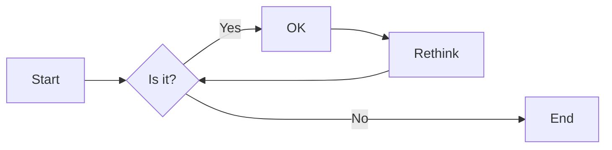
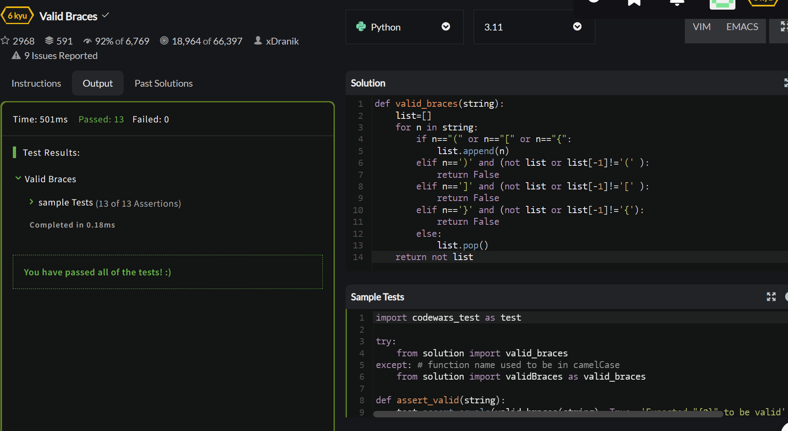
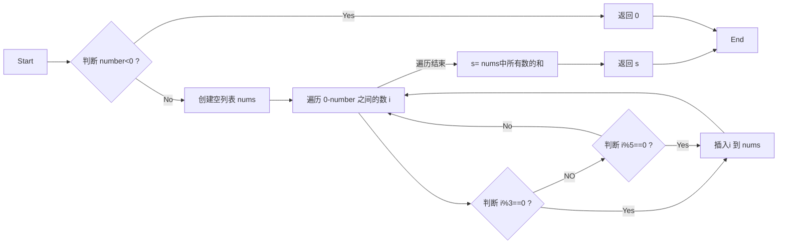
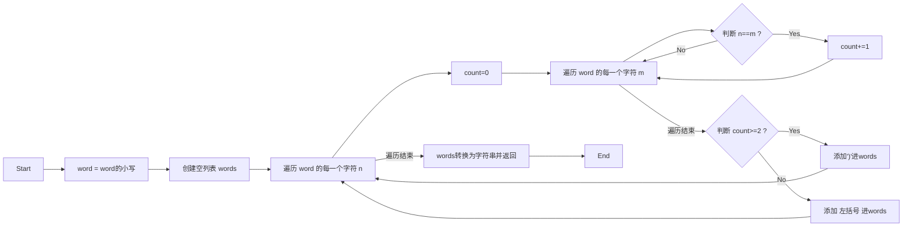
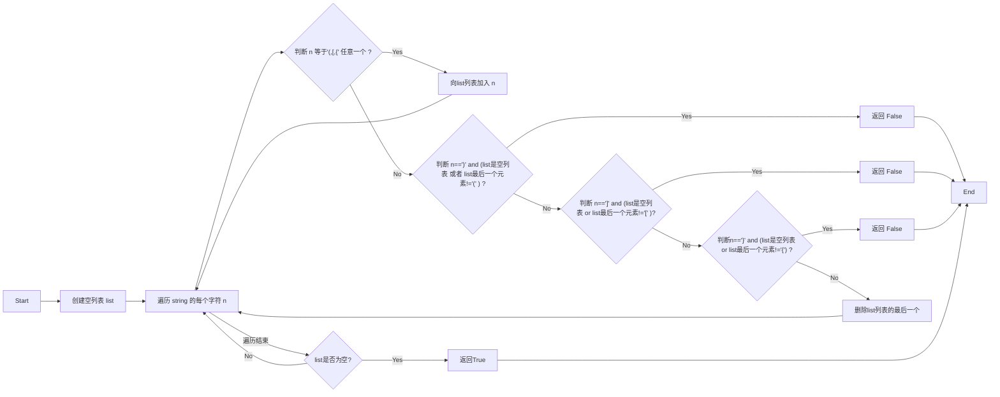
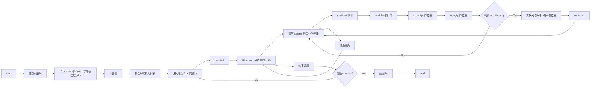
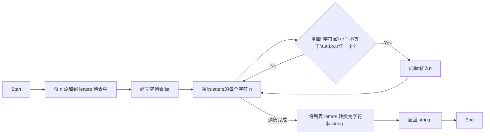

# 实验三 Python列表

班级： 21计科1

学号： 20190202222

姓名： 陈乐

Github地址：<https://github.com/lechen20/python_course>

CodeWars地址：<https://www.codewars.com/users/lechen20>

---

## 实验目的

1. 学习Python的简单使用和列表操作
2. 学习Python中的if语句

## 实验环境

1. Git
2. Python 3.10
3. VSCode
4. VSCode插件

## 实验内容和步骤

### 第一部分

Python列表操作

完成教材《Python编程从入门到实践》下列章节的练习：

- 第3章 列表简介
- 第4章 操作列表
- 第5章 if语句

---

### 第二部分

在[Codewars网站](https://www.codewars.com)注册账号，完成下列Kata挑战：

---

#### 第一题：3和5的倍数（Multiples of 3 or 5）

难度： 6kyu

如果我们列出所有低于 10 的 3 或 5 倍数的自然数，我们得到 3、5、6 和 9。这些数的总和为 23. 完成一个函数，使其返回小于某个整数的所有是3 或 5 的倍数的数的总和。此外，如果数字为负数，则返回 0。

注意：如果一个数同时是3和5的倍数，应该只被算一次。

**提示：首先使用列表解析得到一个列表，元素全部是3或者5的倍数。
使用sum函数可以获取这个列表所有元素的和.**

代码提交地址：
<https://www.codewars.com/kata/514b92a657cdc65150000006>

---

#### 第二题： 重复字符的编码器（Duplicate Encoder）

难度： 6kyu

本练习的目的是将一个字符串转换为一个新的字符串，如果新字符串中的每个字符在原字符串中只出现一次，则为"("，如果该字符在原字符串中出现多次，则为")"。在判断一个字符是否是重复的时候，请忽略大写字母。

例如:

```python
"din"      =>  "((("
"recede"   =>  "()()()"
"Success"  =>  ")())())"
"(( @"     =>  "))(("
```

代码提交地址:
<https://www.codewars.com/kata/54b42f9314d9229fd6000d9c>

---

#### 第三题：括号匹配（Valid Braces）

难度：6kyu

写一个函数，接收一串括号，并确定括号的顺序是否有效。如果字符串是有效的，它应该返回True，如果是无效的，它应该返回False。
例如：

```python
"(){}[]" => True 
"([{}])" => True
 "(}" => False
 "[(])" => False 
"[({})](]" => False
```

**提示：
python中没有内置堆栈数据结构，可以直接使用`list`来作为堆栈，其中`append`方法用于入栈，`pop`方法可以出栈。**

代码提交地址
<https://www.codewars.com/kata/5277c8a221e209d3f6000b56>

---

#### 第四题： 从随机三元组中恢复秘密字符串(Recover a secret string from random triplets)

难度： 4kyu

有一个不为你所知的秘密字符串。给出一个随机三个字母的组合的集合，恢复原来的字符串。

这里的三个字母的组合被定义为三个字母的序列，每个字母在给定的字符串中出现在下一个字母之前。"whi "是字符串 "whatisup "的一个三个字母的组合。

作为一种简化，你可以假设没有一个字母在秘密字符串中出现超过一次。

对于给你的三个字母的组合，除了它们是有效的三个字母的组合以及它们包含足够的信息来推导出原始字符串之外，你可以不做任何假设。特别是，这意味着秘密字符串永远不会包含不出现在给你的三个字母的组合中的字母。

测试用例：

```python
secret = "whatisup"
triplets = [
  ['t','u','p'],
  ['w','h','i'],
  ['t','s','u'],
  ['a','t','s'],
  ['h','a','p'],
  ['t','i','s'],
  ['w','h','s']
]
test.assert_equals(recoverSecret(triplets), secret)
```

代码提交地址：
<https://www.codewars.com/kata/53f40dff5f9d31b813000774/train/python>

提示：

- 利用集合去掉`triplets`中的重复字母，得到字母集合`letters`，最后的`secret`应该由集合中的字母组成，`secret`长度也等于该集合。

```python
letters = {letter for triplet in triplets for letter in triplet }
length = len(letters)
```

- 创建函数`check_first_letter(triplets, first_letter)`，检测一个字母是不是secret的首字母，返回True或者False。
- 创建函数`remove_first_letter(triplets, first_letter)`,  从三元组中去掉首字母，返回新的三元组。
- 遍历字母集合letters，利用上面2个函数得到最后的结果`secret`。

---

#### 第五题： 去掉喷子的元音（Disemvowel Trolls）

难度： 7kyu

喷子正在攻击你的评论区!
处理这种情况的一个常见方法是删除喷子评论中的所有元音(字母：a,e,i,o,u)，以消除威胁。
你的任务是写一个函数，接收一个字符串并返回一个去除所有元音的新字符串。
例如，字符串 "This website is for losers LOL!"   将变成 "Ths wbst s fr lsrs LL!".

注意：对于这个Kata来说，y不被认为是元音。
代码提交地址：
<https://www.codewars.com/kata/52fba66badcd10859f00097e>

提示：

- 首先使用列表解析得到一个列表，列表中所有不是元音的字母。
- 使用字符串的join方法连结列表中所有的字母，例如：

```python
last_name = "lovelace"
letters = [letter for letter in last_name ]
print(letters) # ['l', 'o', 'v', 'e', 'l', 'a', 'c', 'e']
name = ''.join(letters) # name = "lovelace"
```

---

### 第三部分

使用Mermaid绘制程序流程图

安装VSCode插件：

- Markdown Preview Mermaid Support
- Mermaid Markdown Syntax Highlighting

使用Markdown语法绘制你的程序绘制程序流程图（至少一个），Markdown代码如下：


显示效果如下：



查看Mermaid流程图语法-->[点击这里](https://mermaid.js.org/syntax/flowchart.html)

使用Markdown编辑器（例如VScode）编写本次实验的实验报告，包括[实验过程与结果](#实验过程与结果)、[实验考查](#实验考查)和[实验总结](#实验总结)，并将其导出为 **PDF格式** 来提交。

## 实验过程与结果

- [第一部分 Python列表操作和if语句](#第一部分)
```python   
# 练习3-5
print(list[0]+"can't come")
list[0]="chen"
print(list)

```     


```python   
# 练习3-6
list.insert(0,"wu")
list.insert(2,"hu")
list.append("xiao")
print(list)

```   

```python   
# 练习3-7
list=['wu', 'chen', 'hu', 'li', 'wang', 'xiao']
for n in range(0,4):
    num=1
    num+=1
    lev=list.pop(num)
    print(lev +",I'm sorry")
print(list)

```   

```python   
# 练习3-8
want=['beijin','shanghai','shenzhen','wuhan','xianggang']
want.sort()
print(want)

```

- [第二部分 Codewars Kata挑战](#第二部分)   
  
```python   

# 第一题：3和5的倍数（Multiples of 3 or 5）
def solution(number):
    if number<0:
        return 0
    nums=[]
    for i in range(0,number):
        if i%3==0:
            nums.append(i)
        elif i%5==0:
            nums.append(i)
    s = sum(nums)
    return s

```    


```python   

# 第二题： 重复字符的编码器（Duplicate Encoder）

def duplicate_encode(word):
    word = word.lower()  # 将所有字母转换为小写，以忽略大小写
    words=[]
    for n in word:
        count=0
        for m in word:
            if n==m:
                count+=1
        if count>=2 :
            words.append(')')
        else:
            words.append('(')
    return ''.join(words) #将列表的字符合并成字符串

```    


```python   

# 第三题：括号匹配（Valid Braces）    
def valid_braces(string):
    list=[]
    for n in string:
        if n=="(" or n=="[" or n=="{":
            list.append(n)
        elif n==')' and (not list or list[-1]!='(' ):
            return False
        elif n==']' and (not list or list[-1]!='[' ):
            return False
        elif n=='}' and (not list or list[-1]!='{'):
            return False
        else:
            list.pop()
    return not list

```    
 

 ```python   

# 第四题： 从随机三元组中恢复秘密字符串(Recover a secret string from random triplets) 
def recoverSecret(triplets):
    lis=[]
    lis = [i for triplet in triplets for i in triplet]
    lis=set(lis)                 #去重
    lis=list(lis)
    
    while True:
        count=0
        for i in range(len(triplets)):
            for j in range(len(triplets[i])-1):
                m=triplets[i][j]
                n=triplets[i][j+1]
                in_m=lis.index(m)
                in_n=lis.index(n)
                if in_m>in_n:
                    temp=lis[in_m]
                    lis[in_m]=lis[in_n]
                    lis[in_n]=temp
                    count+=1
        if count==0:
            return ''.join(lis)

```   
   

```python   

# 第五题： 去掉喷子的元音（Disemvowel Trolls）  
def disemvowel(string_):
    letters = [letter for letter in string_ ]
    list=[]
    for n in letters:
        if n.lower()!='a' and n.lower()!='e' and n.lower()!='i' and n.lower()!='o' and n.lower()!='u':
            list.append(n)
    string_ = ''.join(list)
    return string_


```    


- [第三部分 使用Mermaid绘制程序流程图](#第三部分)     

1.  3和5的倍数（Multiples of 3 or 5）  



2. 重复字符的编码器（Duplicate Encoder）  



3. 括号匹配（Valid Braces）  



4. 从随机三元组中恢复秘密字符串(Recover a secret string from random triplets)   
   



5. 去掉喷子的元音（Disemvowel Trolls）




## 实验考查

请使用自己的语言并使用尽量简短代码示例回答下面的问题，这些问题将在实验检查时用于提问和答辩以及实际的操作。

1. Python中的列表可以进行哪些操作？     
   
添加元素：使用append()、extend()、insert()等方法向列表中添加元素。    
删除元素：使用remove()、pop()、del等方法删除列表中的元素。   
修改元素：通过索引修改列表中的元素。    
查找元素：使用in、not in等操作符查找元素是否在列表中。    
切片操作：通过切片操作获取列表中的子集。   
排序：使用sort()方法对列表进行排序。    
反转：使用reverse()方法将列表中的元素反转。   
统计元素个数：使用count()方法统计列表中某个元素的个数。    
迭代：使用for循环迭代列表中的元素。    
复制：使用copy()方法复制列表。   
合并：使用+操作符或extend()方法将两个列表合并。   
清空：使用clear()方法清空列表中的所有元素。   

2.  哪两种方法可以用来对Python的列表排序？这两种方法有和区别？   
   (1) sort()方法：sort()方法是列表对象的方法，直接对原列表进行排序。它会修改原列表，将其按照升序进行排序。例如，对列表a进行排序：a.sort()。sort()方法不会返回新的列表，而是直接在原列表上进行操作。   
   (2) sorted()函数：sorted()函数是Python内置的函数，它接受一个可迭代对象作为参数，并返回一个新的已排序的列表。例如，对列表a进行排序：sorted(a)。sorted()函数会返回一个新的列表，而不会修改原列表。      
   这两种方法的主要区别在于对原列表的处理方式。sort()方法直接在原列表上进行排序，而sorted()函数会返回一个新的已排序的列表，不会修改原列表。因此，如果需要保留原列表的顺序，可以使用sorted()函数。如果希望直接在原列表上进行排序，可以使用sort()方法。   

3.  如何将Python列表逆序打印？   
    使用切片操作:my_list = [1, 2, 3, 4, 5]    
                reversed_list = my_list[::-1]   
                print(reversed_list)   
    使用reverse()方法: my_list = [1, 2, 3, 4, 5]   
                      my_list.reverse()    
                      print(my_list)


    
4.  Python中的列表执行哪些操作时效率比较高？哪些操作效率比较差？是否有类似的数据结构可以用来替代列表？    
    效率比较高:
        添加元素：使用append()方法向列表末尾添加元素的时间复杂度为O(1)   
        访问元素：通过索引访问列表中的元素的时间复杂度为O(1)，即常数时间   
        切片操作：切片操作的时间复杂度为O(k)，其中k为切片的长度   
    效率比较差:   
        删除元素：使用remove()方法删除指定元素的时间复杂度为O(n)，其中n为列表的长度。   
        插入元素：使用insert()方法在指定位置插入元素的时间复杂度为O(n)，其中n为列表的长度。   
    数据结构来替代列表，例如链表（linked list）或双向链表（doubly linked list）。链表在删除和插入操作上具有较高的效率，但在访问元素时效率较低。    

5.  阅读《Fluent Python》Chapter 2. An Array of Sequence - Tuples Are Not Just Immutable Lists小节（p30-p35）。总结该小节的主要内容。
    元组是不可变的序列类型，类似于列表，但元组的元素不能被修改。元组可以通过逗号分隔的方式创建，也可以使用tuple()函数创建。   
    元组可以用作字典的键，而列表不能。这是因为字典的键需要是不可变类型。   
    元组可以用作函数的返回值，可以将多个值打包成一个元组返回。   
    元组拆包（tuple unpacking）是一种非常方便的操作，可以将元组的元素分别赋值给多个变量。   
    元组可以用作函数的参数，可以将一个元组传递给函数，函数可以使用拆包的方式获取元组的元素。   
    命名元组（named tuple）是一种具名的元组，可以给元组的每个字段命名，使得代码更加清晰易懂。    
    元组可以用作占位符，可以使用占位符元组来表示一些不需要的值。    
    元组可以通过比较运算符进行比较，比较的规则是从左到右逐个比较元素，直到找到不同的元素为止。   
    元组可以通过加法运算符进行合并，产生一个新的元组。   
    总结：元组是一种非常灵活和有用的数据结构，可以用于多种场景，如函数返回值、函数参数、字典键等。元组的不可变性使得其在多线程环境下更加安全，同时也可以作为一种约束，防止意外修改数据。    

## 实验总结

总结一下这次实验你学习和使用到的知识，例如：编程工具的使用、数据结构、程序语言的语法、算法、编程技巧、编程思想。
